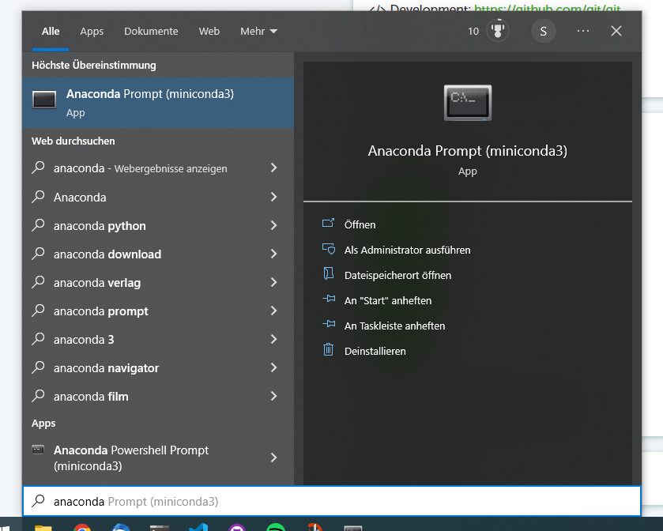

# EinfuehrungPython

Die Dateien sollen euch eine kleine Einführung geben, damit ihr statistische Tests in Python ausführen könnt. 

Die Reihenfolge der Bearbeitung ist in folgender Weise gedacht:

0. Grundlegendes zu Python*
1. KorrelationTTest
2. Hintergründe T-Tests*
3. ANOVA
4. ANOVA-Hintergrund
5. repeated measures ANOVA

________________________________________________________
\* wird erstellt

## Vorbereitung

Letzendlich gibt es viele verschiedene Möglichkeiten die Files zu bearbeiten. Ich gebe euch eine kleine Einführung, wie ihr die Dateien downloaden könnt und sie anschließend bearbeiten könnt. Vorher zeige ich euch noch, wie man Python installiert und Python Packages und anderes mit Anaconda installiert.

### Python Installation und Installation von Packages

1. Downloadet und installiert die aktuelle Miniconda Version: https://docs.conda.io/en/latest/miniconda.html (abhängig von eurem Betriebssystem)
2. Installiert benötigte Packages, z.B. numpy, pandas, seaborn, pingouin (unvollständige Liste). Ihr solltet am Ende selbstständig fähig sein, Packages, die euch möglicherweise fehlen, zu installieren. Hierzu müsst ihr als erstes Anaconda Prompt öffnen. Für Windows z.B. siehe unten:

3. Wenn wir z.B. numpy installieren wollen, googlen wir "numpy conda install"
4. Die Ergebnisse sollten relativ früh einen Link zu anaconda.org enthalten

5. Auf der dazugehörigen Seite finden wir den nötigen Befehl, um Numpy zu installieren

6. Wenn ihr den Befehl eingegeben hat, wird einiges passieren und Anaconda euch nochmal fragen, ob ihr wirklich das Package installieren wollt. Das macht ihr indem ihr "y" eingebt und mit Enter bestätigt. 
7. Wiederhole die Schritte für alle Packages, die noch nötig werden.

### Um die Notebooks zu öffnen...
...könnt ihr entweder Jupyter-Notebook installieren. Dazu geht ihr wie mit den Packages oben vor und googlet "jupyter conda install".

oder ihr nutzt VS-Code, was ich ein bisschen angenehmer finde, aber etwas komplizierter einzurichten ist. 

1. Downloadet VS-Code: https://code.visualstudio.com/
2. und folgt dem YouTube Video, was das ganze gut erklärt: https://www.youtube.com/watch?v=3Wt00qGlh3s&ab_channel=OpenSourceOptions oder hier https://www.youtube.com/watch?v=sts3CFewvkY&t=475s&ab_channel=OpenSourceOptions
3. Neben der Python Extension müsst ihr noch darauf achten, dass auch die Jupyter Extension installiert ist, danach sollte es euch aber möglich sein die Notebooks in VS-Code zu öffnen.

### Download der Materialien (einfach)

1. Klickt auf den grünen Code Button.

2. Klickt auf "Download ZIP"
3. Entpackt die Datei wo ihr damit arbeiten wollt

### Download (etwas schwerer)
1. Öffnet Anaconda Prompt und installiert git (wie oben bei der Python Installation)
2. Dann gebt ihr folgendes in den Terminal ein: `git clone https://github.com/sriemannn/Einf-hrungPython.git <Zieldateipfad>` und füge den Dateipfad zu dem Ordner ein, in dem du gerne die Dateien speichern möchtest. Den Pfad kannst du in Windows zum Beispiel direkt kopieren und anschließend mit einem Rechtsklick in das Terminal einfügen. 
